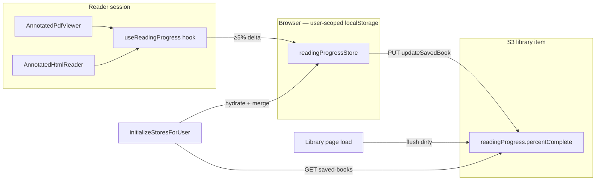

# WIP — Library reading progress + reader Nav panel — ARCHIVED

**Completed:** 2026-07-21 · Nav panel, percent-only persist (5% threshold), library sync/resume, bottom seek bar (PDF + EPUB), library card inline progress

**Paths:** `apps/web/src/components/readers/` · `apps/web/src/pages/dashboard/library/` · `apps/web/src/stores/persistence/` · `packages/shared/storage-client/src/types/saved-books.ts` · `packages/services/core-service/src/controllers/LibraryController.ts`  
**Related:** `memory/SHIPPED_MILESTONES.md` · `memory/wip_web-app-mci.md` (Library shell) · `memory/.archive/wip_epub-reader-html-preprocess.md` ✅ · `memory/ARCHITECTURE_CONCEPTS.md` § Request path  
**Out of scope:** Quest/adventure progress · cross-user shared progress (teammate sees their own copy) · legislative cleanup · progress UI for books **not** in library (see Open questions)

---

## Status

| | |
|--|--|
| **Phase** | **archived** — Phases 1–4 shipped |
| **Loop** | 2 |
| **Updated** | 2026-07-21 |
| **Residual** | Reader annotation yield items (note/tag/highlight smoke) — track separately if needed |

---

## Shipped — Phase 1 Nav UI (2026-07-21)

Reader sidebar **Nav** panel and live progress **display** (no backend / no localStorage yet).

### Shared

| Item | Shipped |
|------|---------|
| Card title **Quick View → Nav** | ✅ both readers |
| **`ReaderNavTitleRow.tsx`** | ✅ renamed from `ReaderQuickViewTitleRow`; props `pageCount`, `progressPercent` |
| Title row pattern | ✅ `Title:` + title · optional `Pages:` + N (PDF) · optional `Progress:` + X% (both) — labels `META_CLASS`, values `SUPPORTING_CLASS`, inline wrap |

### PDF (`AnnotatedPdfViewer.tsx`)

| Item | Shipped |
|------|---------|
| **Row 1** — single segmented control | ✅ `[ − ] [ zoom% ] [ + ] \| [ p#### ] [ Go ]` |
| Zoom % | ✅ display in middle segment (`META_CLASS`); fit-width still on click (PDF only) |
| Page input | ✅ static **`p`** prefix + 4-digit-width input; primary text; segment `focus-within` (no browser blue ring) |
| **Row 2** — title metadata | ✅ `Pages: {numPages}` + `Progress: {round(currentPage/numPages*100)}%` |
| Progress updates | ✅ `readingProgressPercent` state; `window` scroll + `visiblePages` sync |

Sidebar width: fits `DashboardActionsLayout` — **16rem** (md–lg) / **20rem** (lg+).

### EPUB (`AnnotatedHtmlReader.tsx`)

| Item | Shipped |
|------|---------|
| **Row 1** — font scale control | ✅ `[ − ] [ 100% ] [ + ]` — middle **display-only** (not a reset button) |
| Font scale % | ✅ `META_CLASS` (matches PDF zoom % styling) |
| **Row 2** — title metadata | ✅ `Progress: {scrollPercent}%` |
| Progress updates | ✅ `readingProgressPercent` in existing scroll listener (`scrollTop / maxScroll`) |
| Chapter nav | ✅ unchanged below title row |

### Not in Phase 1 (approved — implement next)

- ~~`readingProgressStore` + threshold persist (**5%**)~~ ✅
- ~~`SavedBookDocument.readingProgress` — **`percentComplete` only**~~ ✅
- ~~`LibraryReadingProgressBar` — bottom of reader main pane (library books only)~~ ✅
- ~~`useReadingProgress` hook~~ ✅

### Related (same session, out of WIP scope)

- Removed auto **assistant focus on reader open** (`useBookReaderFocus` deleted) — reading no longer adds book to companion focus

---

## Next work — three steps (Zach, 2026-07-21) — **approved**

| Step | What | Trigger |
|------|------|---------|
| **1** | **Browser store** (`readingProgressStore`) | **5% threshold** writes only — not time/debounce. No write if the user never moves. |
| **2** | **Library record** (`SavedBookDocument.readingProgress`) | **`percentComplete` only** — flushed from browser store at login + library page load. |
| **3** | **Bottom progress bar** (`LibraryReadingProgressBar`) | Library saved books only — same live % as Nav title row. |

**UI display** stays **live** while reading. Only **persistence writes** are threshold-gated.

---

## Product direction (Zach, 2026-07-21)

### Reader Nav panel (both formats) — locked

- Sidebar card title: **Nav** (not Quick View).
- **Title row** (`ReaderNavTitleRow`): metadata inline after title, wraps naturally.
  - **PDF:** `Pages: {N}` + `Progress: {X}%`
  - **EPUB:** `Progress: {X}%` only (no page count)

### PDF Nav controls — locked

Single control bar (row 1): `[ − ] [ zoom% ] [ + ] | p[page] [ Go ]`

### EPUB Nav controls — locked

Font scale middle segment: **display-only**. Chapter nav below title row.

### Progress semantics — **approved: percent only in storage**

| Layer | PDF | EPUB |
|-------|-----|------|
| **Live display** | `round(currentPage / numPages × 100)%` | scroll % |
| **Persist (store + S3)** | **`percentComplete` only** | **`percentComplete` only** |
| **Resume** | derive page from stored % | scroll to stored % |

**No separate `page` field in storage.** PDF page is always computed at read time:

```ts
targetPage = clamp(1, numPages, round(percentComplete / 100 * numPages))
```

Format still implied by `bookKey` for reader routing — not stored on progress object.

### Library progress bar — **not shipped**

- Bottom of reader **main pane**; visible only when `recordKey` known.
- Fill = same live % as Nav title row.

### Persistence model — local-first, **5% threshold**, sync on checkpoints — **approved**

| Tier | Storage | When to write |
|------|---------|---------------|
| **Hot** | Browser `readingProgressStore` | `\|currentPercent − lastSavedPercent\| ≥ 5` |
| **Cold** | `SavedBookDocument.readingProgress` | Login + library page load (dirty flush only) |

#### Step 1 — Browser store write rules

**No timer. No debounce.** Idle book = zero writes.

**Single write rule (both formats):**

```
currentPercent = round(progress × 100)   // PDF: progress = currentPage/numPages; EPUB: scroll fraction
write when |currentPercent − lastSavedPercent| ≥ PROGRESS_WRITE_THRESHOLD
PROGRESS_WRITE_THRESHOLD = 5
```

**PDF equivalent (informational):** on a 330-page book, 5% ≈ **17 pages** of movement before the next save (`round(330 × 0.05)`). No separate page field — compare **percent** only.

Examples:

- EPUB at 3%, no scroll → **no writes**.
- EPUB 3% → 7% → **no write** (Δ4 < 5).
- EPUB 3% → 9% → **write `{ percentComplete: 9 }`** once.
- PDF page 1 → 10 on 330 pages (3% → 3%) → **no write**.
- PDF page 1 → 20 (~6%) → **write `{ percentComplete: 6 }`**.

**Scope:** only saved library books (`recordKey` known). Catalog-only: no persist, no bottom bar.

**On each qualifying write:** update local entry, `dirty: true`, bump `clientUpdatedAt`.

#### Step 2 — Library record sync — locked

Flush dirty browser entries at **login** (hydrate + merge + push) and **library page load** (push).

#### Step 3 — Bottom progress bar — locked

Visual cue for library books; persistence follows Steps 1–2.

**Resume on open:** read `percentComplete` from browser (prefer dirty local) or server after hydrate.

- **EPUB:** `?percent=N` → scroll viewer on ready.
- **PDF:** `?percent=N` → compute `targetPage` → existing page scroll (or derive at navigation time in `SavedBooks.handleBookClick`).

---

## Architecture



> **Today:** display % inline in readers; no hook/store/backend yet.

### Data shape (Phase 2) — **approved**

**On `SavedBookDocument`:**

```ts
export interface SavedBookReadingProgress {
  percentComplete: number   // 0–100 integer
  updatedAt: string           // ISO
}

export interface SavedBookDocument {
  // …existing fields…
  readingProgress?: SavedBookReadingProgress
}
```

**In browser store:**

```ts
type LocalReadingProgress = {
  bookKey: string
  recordKey: string
  percentComplete: number     // last threshold-saved %
  clientUpdatedAt: number
  dirty: boolean
}
```

**Hook sketch** (`useReadingProgress`):

```ts
const PROGRESS_WRITE_THRESHOLD = 5

maybePersistProgress({ bookKey, recordKey, currentPercent }) {
  if (!recordKey) return
  const last = store.getProgress(bookKey)?.percentComplete ?? -999
  if (Math.abs(currentPercent - last) < PROGRESS_WRITE_THRESHOLD) return
  store.setProgress({ bookKey, recordKey, percentComplete: currentPercent, dirty: true })
}

// PDF resume helper
function pageFromPercent(percent: number, numPages: number): number {
  return Math.max(1, Math.min(numPages, Math.round((percent / 100) * numPages)))
}
```

---

## Sync rules (Phase 3)

### Login hydrate

1. `GET /library/saved-books`
2. Per book: seed local from server unless local dirty + newer
3. Flush remaining dirty after merge

### Library page flush

`readingProgressStore.flushDirty()` → `PUT updateSavedBook(recordKey, { readingProgress: { percentComplete, updatedAt } })`

---

## Implementation phases

### Phase 1 — Reader Nav UI ✅

- [x] Rename **Quick View → Nav**
- [x] **`ReaderNavTitleRow`** — `pageCount`, `progressPercent`
- [x] PDF + EPUB Nav controls + live Progress display

### Phase 2 — Browser store + library schema — ✅ shipped

- [x] `readingProgressStore.ts` + `initializeStoresForUser`
- [x] `useReadingProgress` — **5%** threshold; `percentComplete` only; `recordKey` lookup
- [x] `SavedBookReadingProgress` on `saved-books.ts` — **percent only**
- [x] `coreApi` + `LibraryController` pass-through

### Phase 3 — Library sync + resume + bottom bar — ✅ shipped

- [x] Login hydrate + merge; flush dirty
- [x] Library page load → `flushDirty()`
- [x] `SavedBooks.handleBookClick` — `?percent=` from store (PDF + EPUB)
- [x] PDF load `?percent=` → `pageFromPercent` → scroll
- [x] EPUB load `?percent=` → scroll on ready
- [x] **`LibraryReadingProgressBar`**

### Phase 4 — Yield — code shipped; manual smoke open

- [x] Unit tests — `readingProgressUtils.test.ts` (5% threshold, `pageFromPercent`, resume URL, local/server merge)
- [x] Threshold fix — no spurious write at 0% on first open (unset baseline requires ≥5% before first save)
- [x] **`LibraryItemCard`** — inline progress bar + `N%` label for **own** saved books
- [x] **EPUB seek bar** — draggable accent head with % (`LibraryReadingProgressBar` + `onSeek`)

#### Reading progress yield

- [ ] Manual smoke: PDF read → 5% jumps persist → library sync → reopen at derived page
- [ ] Manual smoke: EPUB scroll → 5% jumps persist → library sync → reopen at ~same %
- [ ] Manual smoke: catalog-only → no bar, no persist
- [ ] **PDF seek bar** — draggable head + % (parity with EPUB); wire `onSeek` in `AnnotatedPdfViewer` — **blocks WIP close**

#### Reader annotation yield (same WIP — reader surface)

- [ ] Note/tag on paragraph — margin icon appears; sidebar click navigates once (re-click does not creep scroll/progress)
- [ ] Note/tag on image — margin icon visible and tappable *(known gap: void-element host — fix pending)*
- [ ] Highlight — select in sidebar scrolls to mark without repeated upward drift
- [ ] Teammate annotation — correct owner avatar + type icon in sidebar

---

## Files touched

| Area | Files | Status |
|------|-------|--------|
| Nav UI | `ReaderNavTitleRow.tsx`, `AnnotatedPdfViewer.tsx`, `AnnotatedHtmlReader.tsx` | ✅ shipped |
| Removed | `ReaderQuickViewTitleRow.tsx`, `useBookReaderFocus.ts` | ✅ |
| Types | `saved-books.ts`, `coreApi.ts` | ✅ shipped |
| Backend | `LibraryController.ts` | ✅ pass-through (no change needed) |
| Store | `readingProgressStore.ts`, `readingProgressSync.ts`, `initializeStores.ts` | ✅ shipped |
| Hook | `useReadingProgress.ts`, `LibraryReadingProgressBar.tsx`, `readingProgressUtils.ts` | ✅ shipped |
| Library | `library/index.tsx`, `SavedBooks.tsx`, `BookEpubReader.tsx`, `BookPdfReader.tsx` | ✅ shipped |
| Phase 4 | `LibraryItemCard.tsx`, `LibraryReadingProgressInline.tsx`, `useLibraryBookProgressPercent.ts`, `readingProgressUtils.test.ts` | ✅ shipped |

---

## Open questions — resolved (Phase 4)

1. **Unsaved catalog reads** — ✅ no bottom bar, no persist until saved to library
2. **Library card display** — ✅ inline bar + `N%` on own and **shared** book rows (viewer's progress)
3. **Logout flush** — ✅ dirty reading progress flushed in `AuthContext.logout` via `flushStoresBeforeLogout()`; broader sign-out UX → `wip_sign-out-goodbye.md`
4. **Teammate copies** — ✅ library card shows **viewer's** progress on shared book rows (book club); persist remains per-user on own `recordKey`
5. **Progress bar label** — reader: bar only; library card: bar + tiny `N%`

---

## Zach's Thoughts

> **Zach adds rows here** — raw notes only. **Joshua:** when a note is folded into the body above, prefix that **existing row** with `DONE:` — never add new rows to this section.

DONE: The small number input is at the end of the title text so not right align and part of the wrap. *(Superseded: progress is read-only `Progress: X%` on title row, not an input.)*

DONE: For pdf it was to have "Quick View" be Nav.

DONE: We do need a way to store progress for a user on both epub and pdf… *(Superseded: store **`percentComplete` only** for both; PDF derives page on resume.)*

DONE: Browser store writes must be **threshold-based**… **Approved: 5% threshold** for EPUB; PDF uses same percent comparison (≈ 5% of total pages in page terms). Not time-based.

DONE: For books in the library, show a small progress bar on the bottom of the reader…

Approved: 5% save for EPUB; same calculated equivalent for PDF based on total pages. Only save % progress; applied as page number for PDF on resume.
