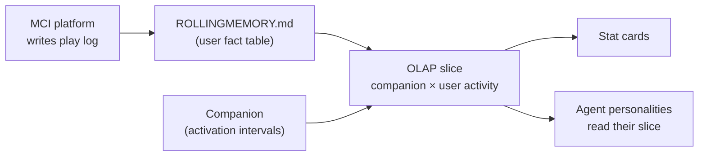
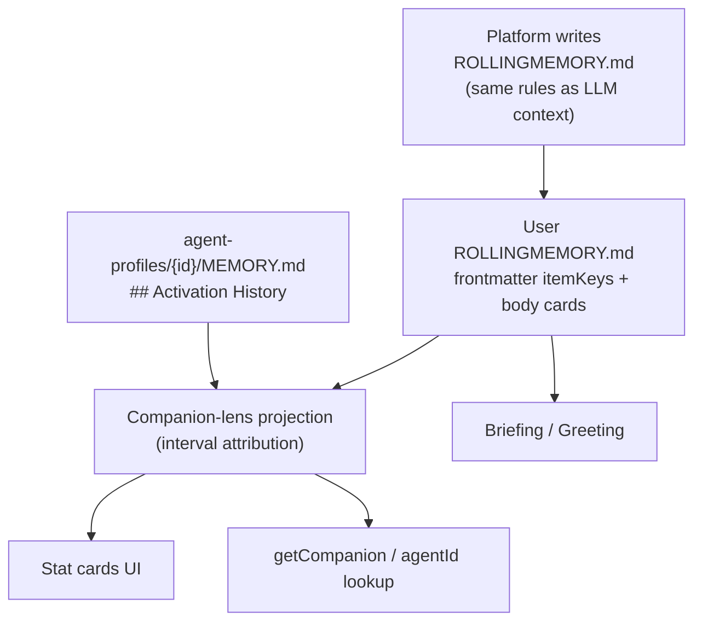
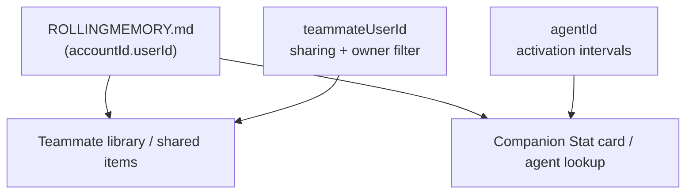

# WIP — Teammates companion **Stat cards** + shared library link — ARCHIVED

**Completed:** 2026-07-21 · Phase 1 companion-lens projection + Stat cards UI shipped; shared library link + owner filter shipped in Phase 0b

**Paths:** `apps/web/src/pages/dashboard/contacts/` · `packages/services/rap-service/src/services/stats/` · `StatService.ts` · `assistantStatProjection.ts` · `AssistantToolService.ts` · `agentActivationMemory.ts` · `briefingGreetingAgents.ts` (pattern reference)  
**Naming:** Backend = **Assistant** (tools, routes). UI = **Companion** (Stat cards). Stats domain = **`services/stats/StatService`** (assistant lens today; guide lens later).
**Related:** `memory/SHIPPED_MILESTONES.md` · `docs/sample-files/ROLLINGMEMORY-userId_1.md` · `MEMORY.md` (## Activation History) · `WORKSPACE.md` § Agents · `memory/.archive/wip_library-reading-progress.md` ✅  
**Route:** UI label **Teammates** — code route stays `/dashboard/contacts` (PolicyCommand parity)  
**Out of scope:** Platform guide rewrites · cross-account stats · competitive leaderboards · legislative cleanup · rigid server-side DTO types

---

## Status

| | |
|--|--|
| **Phase** | **archived** — Phase 1 shipped |
| **Loop** | 6 |
| **Updated** | 2026-07-21 |
| **Deferred** | Phase 2 quest/adventure depth; Phase 3 teammate mana — see Open questions in body |

---

## Product direction

**Stat the companions, not the user.** Each companion gets a **Stat card** — like a Pokémon or baseball card: avatar, name, a handful of iconic **stats** that tell their story with *this* user. The teammate row may show a compact **party TOTAL**, but the emotional center is **Kermit · Merlin · Speedy** — not “Zach read 12 books.”

**Naming:** **Stat card** / **stats** — not “scorecard.” Stats are friendly, collectible, narrative — not competitive scoring.

### OLAP mental model (Zach, 2026-07-21)

Old-school **OLAP**, MCI edition: we are **slicing the platform’s play stats of the user through their companions.**

| OLAP term | MCI equivalent |
|-----------|----------------|
| **Fact table** | User `ROLLINGMEMORY.md` — platform-written activity log (`Last touched`, section cards, frontmatter itemKeys) |
| **Slice dimension** | **Companion** — `## Activation History` in each companion’s `MEMORY.md` defines when that personality was on duty |
| **Measure / rollup** | Stat rows on the card (books at your shoulder, chats, quests, career time, presence %) |
| **Presentation** | Stat cards (UI), briefing beats, `getCompanion` enrichment |

One event stream. Many consumers:

- **Briefing / Greeting** — “since last login” narrative for the active companion  
- **Stat cards** — collectible face card per roster companion (Teammates detail)  
- **The army of agents** — each companion, with the personality **you** gave them, reads *their slice* of the same log as context

The platform creates the log. The companions interpret it. No separate analytics warehouse — the harness already writes the facts; the companion lens is the **slice**, not a fork.



### Teammates surfaces (TODO line 15)

| Surface | Status |
|---------|--------|
| Link to teammate **shared library** (when `theyShare`) | ✅ Done — accent LinkPills + `?owner=` filter |
| **Companion Stat cards** on contact detail — one card per roster companion | ✅ Phase 1 |
| **Active Companion** card (avatar + IDENTITY fields for today's active) | ✅ retained alongside stat grid |
| Table row: active companion + optional compact hint (top companion by presence) | 🔲 Optional v1 |

---

## Core insight — companion lens, not a new datastore

`ROLLINGMEMORY.md` is **the user’s file**. We do **not** invent a parallel “companion scorecard” schema or persist companion stats separately.

Same pattern as **briefing**:

1. Platform rules **write** rolling memory (cards, frontmatter keys, `Last touched`)
2. A read pipeline **projects** that file for a consumer (briefing → greeting; Stat cards → UI + agent lookup)
3. The **view model is dynamic** — it emerges from whatever sections and cards exist today, not from a fixed TypeScript type

**Companion slice** = a **lens** over the user’s rolling memory:

- **Input:** user-scoped `ROLLINGMEMORY.md` (YAML frontmatter + section cards) + per-companion `MEMORY.md` → `## Activation History`
- **Lens:** “Which companion was active when the user touched this item?” (reading buddy / shoulder partner)
- **Output:** Stat card projection per `agentId` — for Teammates UI **and** as an optional datapoint on **agentId lookup** (companions can “know” their career stats with this user)



**We control the data-flow steps, not a frozen type.** Data flows like water: rolling memory in → attribution rules → rendered stats out. New rolling sections or card fields can surface new stats when the mapping table says so.

**Existing correlation:** `StatService.getAssistantPartyStats` and `get_assistant` tool use the same projection. `AssistantToolService.getAssistant` loads persona; stats attach in `GetAssistantExecutor`.

---

## Source of truth — rolling memory template

Canonical section model (`packages/services/rap-service/src/agent-templates/_system/agent-persona/ROLLINGMEMORY.md`).

**Design rule:** pick the **stat slice** first — the OLAP overlay (activation interval × `Last touched`) answers most count questions in one pass. Deep joins (chat turn → `agentId` per trace) are lego bricks we *can* snap on when precision matters; default to rolling memory + interval unless the stat explicitly needs per-turn attribution.

| Frontmatter key | Section | Role | Companion stat slice / count call |
|-----------------|---------|------|-----------------------------------|
| `agentIds` | `## Agents` | Roster pointers — one card per companion | **Identity / lifecycle** (no interval overlay): `Agents.{agentId}.createdAt` → **New** badge when `createdAt >= now − Xd`; `updatedAt` → recently edited; card body → Stat card face (name, catchphrase, avatar meta). Count: `count(agentId)` = roster size. |
| `chatHistoryIds` | `## Chats` | Chat activity cards | **Preferred:** `count(chatHistoryId \| card.Last touched ∈ agentInterval)` — one chat credited to whoever was on duty at last touch. **Deep (optional):** `sum(get_chat_history(id).turns where turn.agentId === agentId)` — each turn snapshots `agentId` at save time (`ChatTurnRecord`); 100% available via trace, but slower; reserve for per-turn rollups (Phase 2). |
| `bookKeys` | `## Books` | Book focus / reading activity | `count(bookKey \| card.Last touched ∈ agentInterval)` — “books at your shoulder.” Phase 2: add `readingProgress.updatedAt ∈ interval` for pages-over-shoulder. |
| `adventureUuids` | `## Adventures` | Adventure activity | `count(adventureUuid \| card.Last touched ∈ agentInterval)` |
| `questHistoryIds` | `## Quests` | Quest activity | `count(questHistoryId \| card.Last touched ∈ agentInterval)` |
| `libraryItemKeys` | `## Library` `libraryItemKey` | Library save activity (composite `book:{bookKey}` · `chat:{chatHistoryId}`) | `count(libraryItemKey \| card.Last touched ∈ agentInterval)` |
| `annotationIds` | `## Annotations` | Annotation activity | `count(annotationId \| card.Last touched ∈ agentInterval)` |
| `teammateUserIds` | `## Teammates` `teammateUserId` | Sharing prefs — **teammate dimension**, not companion stats | `teammate.{teammateUserId}.{itemKeyType}:{id}` + `theyShare` gate — library/visibility slice (✅ shipped). Not attributed via agent intervals. |

**Cross-section measures (companion lens, not a rolling section):**

| Stat | Count call |
|------|------------|
| **Career time** | `sum(MEMORY.{agentId}.ActivationHistory intervals)` — full timeline, not pruned with rolling body |
| **Presence %** | `careerTime(agentId) / sum(careerTime(all agentIds))` |

Each activity card’s body carries context the LLM sees (`Title`, `Last touched`, `Book title`, …). **Stat attribution uses the same cards** — especially **`Last touched`** (when *you* last interacted, not catalog update time). The interval overlay is the default “itemKey count call”: filter cards by timestamp, bucket by active `agentId`, `count()` or `sum(body measure)`.

`## Agents` cards carry dynamically merged meta (`name`, `catchphrase`, `lastActivated`, `createdAt`, `updatedAt`, …) — identity for the Stat card face; lifecycle stats read card meta directly, not via interval overlay.

**Activation History** (companion `MEMORY.md`, platform-written) is the authoritative **career timeline** for “when was this reading buddy on duty?” Agents card `lastActivated` / `lastDeactivated` are cache hints; MEMORY wins for interval math.

### Existing files — how the template reaches prod (“brain surgery”)

**Yes — we have a deliberate, conservative process.** Template changes do not blindly overwrite user memory.

| When | What runs | What changes | What is preserved |
|------|-----------|--------------|-------------------|
| **Login / md-editor load / persona write** | `personaTemplateSync.ts` → `syncRollingMemoryOnLogin` | Missing H1 intro; **section layout** recomposed to current template `##` headers + order; **frontmatter `indexKeys`** reconciled from surviving cards | All valid card bodies + meta lines; user-authored content inside cards |
| **Post-turn / library touch / entity write** | `RollingMemoryWriter` / `RollingMemoryIndexService` upsert | Individual cards refreshed to **current meta shape** for that activity type | Unaffected cards untouched |
| **Size cap** | `trimRollingBody` | Oldest whole cards dropped by `Last touched` | At least one card per section type when possible |

Flow: **parse cards → filter valid → recompose to template skeleton → reconcile index arrays → persist only if changed.** Legacy headers (e.g. `## Share settings`) still **parse on read** via `legacyHeaderBases`; recompose writes the canonical header (`## Teammates`).

New template fields (e.g. `libraryItemKeys`) appear in frontmatter on reconcile — empty until the platform writes the first card. Card meta field upgrades follow **re-save is migration**: old cards keep old body lines until the next touch upsert refreshes them. No silent JSON upgrade on read (per backward-compat policy).

**Risk posture:** structural / layout surgery is safe and tested (`RollingMemoryIndexService.test.ts`). Semantic changes to card meta propagate lazily on activity — companions and Stat cards should tolerate mixed card shapes until users (or the harness) touch items again.

### Built-in data dictionary + dimensional addressing (Zach, 2026-07-21)

**Yes — your perspective is accurate.** The rolling memory template is not just a log; it ships a **built-in data dictionary** for every platform datapoint the harness writes:

| Layer | What it is | Example |
|-------|------------|---------|
| **Scope** | Workspace identity | `{accountId}.{userId}` — whose play log |
| **Index keys** | YAML frontmatter arrays | `chatHistoryIds`, `adventureUuids`, `libraryItemKeys` — machine lookup |
| **Section header** | `## {Section} \`{itemKeyType}\`` | `## Chats \`chatHistoryId\`` — names the ID type for every card in that section |
| **Card id** | `### {value}` | `### conv-1780…` — one platform item |
| **Card body** | Context + measures | `Title`, `Last touched`, `Turns`, `Book title`, … — same fields the LLM reads |

Consumers do not guess schema. **Section title + backticks = itemKeyType.** Frontmatter array = index of all ids for that type. Body = attributes and rollups for that item.

**Two slice dimensions, same fact table:**



**Teammate slice** (already shipped for library):

- Address pattern: `{accountId}.{viewerUserId}.teammate.{teammateUserId}.{itemKeyType}:{id}`
- Gate: `theyShare` + display prefs (`## Teammates` cards)
- Meaning: “show me *this teammate’s* shared `{libraryItemKey}` / `{annotationId}` / …”

**Companion / agent slice** (Stat cards + `getCompanion`):

- Address pattern: `{accountId}.{userId}.agent.{agentId}.{itemKeyType}:{id}`
- Lens: Activation History — was this `agentId` on duty at the card’s `Last touched`?
- Meaning: “attribute *this chat / adventure / book touch* to the reading buddy who was active then”

Examples that fall out naturally:

- `{accountId}.{userId}.agent.{agentId}.adventureUuid:{uuid}` — adventures while Kermit was active  
- `{accountId}.{userId}.agent.{agentId}.chatHistoryId:{conv-id}` — chats at your shoulder  
- `{accountId}.{userId}.agent.{agentId}.chatHistoryId:{conv-id}/turnCount` — **measure** from card body (`Turns:`) when present, or deep join via `ChatTurnRecord.agentId` per turn — **prefer interval + card count for Stat cards v1**

**Turn-level lego (available, not default):** Each chat turn persists `agentId` at save time (`packages/shared/storage-client/src/types/chat-history.ts`). Tracing `traceId` → turn → `agentId` gives exact per-companion turn counts. Stat cards Phase 1 should **not** pay that cost — OLAP slice (`Last touched ∈ interval`) + `count(chatHistoryId)` is the fast path. Reach for turn-level joins only when the stat definition requires it (e.g. “turns while Kermit answered, even if you switched companions mid-thread”).

**Parity with teammates:** Same rolling memory file, same dictionary, different slice dimension — teammate by **owner/sharing**, companion by **who was active when you touched it**. Both are OLAP-style overlays on the platform pipeline, not separate warehouses.

**Agent lookup:** `getCompanion(accountId, userId, agentId)` can return the agent’s slice of the dictionary — roster-validated, enriched with activation timeline + projected stats — so the companion personality reads the same datapoints the UI and briefing use.

---

## Data-flow steps (companion-lens projection)

Controlled pipeline — same spirit as briefing card merge:

| Step | What happens |
|------|----------------|
| **1. Load user rolling memory** | Parse frontmatter + all section cards (existing parsers) |
| **2. Resolve roster** | `agentIds` + `## Agents` cards → companion list + display meta |
| **3. Load activation timelines** | Per `agentId`, `MEMORY.md` → `## Activation History` → active intervals |
| **4. Attribute touches** | For each activity card, map `Last touched` → active `agentId` at that instant |
| **5. Roll up stats** | Count / summarize by section type + derived metrics (presence, career span) |
| **6. Project Stat card** | Avatar, name, stat rows with icon + label + value — **dynamic** from step 5 output |
| **7. Emit consumers** | Teammates detail UI · optional table hint · `getCompanion` enrichment |

No step persists a companion-stat file. Re-run projection on read (cache 5–15 min per teammate acceptable).

---

## Stat catalog — section → attribution → icon

Each stat is a **row on the companion’s Stat card**, attributed through the lens. Mapping is **declarative** (config/table driven) so new rolling sections can add stats without renaming types.

| Stat (user-facing) | Rolling section | Frontmatter key | Icon | Count call (companion lens) |
|--------------------|-----------------|-----------------|------|----------------------------|
| **Career time** | — | — | Companion ring / clock | `sum(MEMORY.{agentId} activation intervals)` |
| **Presence** | — | — | Avatar highlight | `careerTime(agentId) / sum(careerTime(*))` |
| **Chats** | `## Chats` | `chatHistoryIds` | Chat bubble | `count(chatHistoryId \| Last touched ∈ interval)` |
| **Books at your shoulder** | `## Books` | `bookKeys` | Book open | `count(bookKey \| Last touched ∈ interval)` |
| **Adventures** | `## Adventures` | `adventureUuids` | Rocket | `count(adventureUuid \| Last touched ∈ interval)` |
| **Quests** | `## Quests` | `questHistoryIds` | Map | `count(questHistoryId \| Last touched ∈ interval)` |
| **Annotations** | `## Annotations` | `annotationIds` | Pencil | `count(annotationId \| Last touched ∈ interval)` |
| **Library saves** | `## Library` | `libraryItemKeys` | Bookmark | `count(libraryItemKey \| Last touched ∈ interval)` |
| **New** | `## Agents` | `agentIds` | Sparkle badge | `Agents.{agentId}.createdAt >= now − Xd` |
| **Joined the party** | `## Agents` | `agentIds` | Sparkle | `Agents.{agentId}.createdAt` (display) |
| **Recently updated** | `## Agents` | — | Pencil | `Agents.{agentId}.updatedAt` |

**Phase 2 — reading depth** (`memory/.archive/wip_library-reading-progress.md`): when saved-book `readingProgress.updatedAt` ∈ interval, credit **pages / progress** on the Stat card — “books read over your shoulder,” not just touched.

**Phase 2 — quest / adventure depth:** completed vs guided (role on adventure card body when present).

**Party TOTAL (user level):** secondary strip — companion count, sum of attributed touches, optional unattributed count. Smaller typography; not the hero.

**Copy tone:** “Speedy · 60% of companion time · 4 books at your shoulder · 2 quests” — narrative, not leaderboard.

---

## Attribution rules

| Input | Rule |
|-------|------|
| **Activation History** | Parse ISO lines; pair activated → deactivated; open interval if last event is activated |
| **Activity card timestamp** | Prefer `Last touched`; fall back to section-specific fields (`Last active`, etc.) |
| **Overlap / gaps** | No companion active at touch → party **unattributed** bucket (show honestly on TOTAL or omit — decide in spike) |
| **Concurrent activations** | Should not happen (`activeAgentKey`); if messy history, latest activated wins |
| **Pruned rolling body** | Activity stats reflect **cards still in file**; career time / presence from full MEMORY history — label mix honestly |
| **Pre-roster activity** | Touches before first companion → unattributed or party-only (decide in spike) |

---

## Where it shows

| Surface | Content |
|---------|---------|
| **Teammates table** | Active companion (today) + optional “top presence” chip |
| **Contact detail** | Stat card grid per roster companion + party TOTAL strip; shared library LinkPills (done) |
| **Agent lookup** | Same projection attached to `getCompanion` / agentId response when viewer is permitted |
| **Shared library** | `/dashboard/library/{tab}?owner={userId}` ✅ |

---

## Privacy / sharing gates

Project Stat cards only when **`theyShare`**. No rolling memory / MEMORY reads for non-sharing teammates. Agent lookup enrichment follows same gate.

**Mana / tokens:** user-level only for v1; not per-companion unless usage events gain `agentId` later.

---

## UI sketch — Stat cards (hero)

```
┌─────────────────────────────────────────────────────────┐
│  Party · 3 companions · 18 moments together            │
└─────────────────────────────────────────────────────────┘

┌──────────────┐  ┌──────────────┐  ┌──────────────┐
│ [Speedy av]  │  │ [Boom av]    │  │ [Kermit av]  │
│ Speedy ★     │  │ Boombaclaut  │  │ Kermit       │
│ 60% presence │  │ 25%          │  │ 15%          │
│ 📚 4 shoulder│  │ 📚 2         │  │ 📚 1         │
│ 💬 3  🧭 2   │  │ 🧭 1         │  │              │
│ Career: 3d   │  │ Joined Jul 20│  │              │
└──────────────┘  └──────────────┘  └──────────────┘

[ Books · Chats · Annotations LinkPills — done ]
```

---

## Phased delivery

| Phase | Deliverable | Status |
|-------|-------------|--------|
| **0** | Product model + companion-lens framing | ✅ |
| **0b** | Shared library link + owner filter | ✅ |
| **1a** | Activation intervals from MEMORY + roster from `## Agents` | ✅ |
| **1b** | Section → stat attribution map + projection pipeline | ✅ |
| **1c** | Contact detail Stat card grid + party TOTAL strip | ✅ |
| **1d** | Enrich agentId lookup with same projection | ✅ |
| **2** | Reading-over-shoulder progress; quest/adventure completed vs guided | ✅ reading depth shipped · quest/adventure depth deferred |
| **3** | Teammate mana (user-level, policy TBD) | 🔲 |

---

## Open questions

1. **Unattributed touches** — show on party TOTAL or hide?  
2. **Pre-roster activity** — party-only or ignore?  
3. **Pruned cards vs full Activation History** — OK to mix for presence vs activity stats?  
4. **Table density** — top companion chip on list or detail-only?  
5. ~~Library URL `?owner=`~~ — ✅ shipped  
6. **Stat card density** — how many stat rows on the card face vs expand?  
7. **Icon registry** — single mapping table shared by UI + future LLM stat summaries?

---

## Test plan

- [ ] Two companions, non-overlapping intervals — book/chat cards attribute by timestamp  
- [ ] Active companion (open interval) — receives touches after last activated  
- [ ] Agent not in `agentIds` — excluded from Stat cards  
- [ ] Dynamic `## Agents` meta surfaces on Stat card face  
- [ ] `theyShare: false` — no projection, no library stats  
- [ ] Party TOTAL = sum of attributed + unattributed (when shown)  
- [ ] `getCompanion` returns same stat projection as Teammates detail (when permitted)  
- [ ] New rolling section added to template — mapping table extended without schema migration

---

## TODO cross-reference

`TODO.md` line 15 — menu rename **done**; library link **done**; companion **Stat cards** tracked here.
