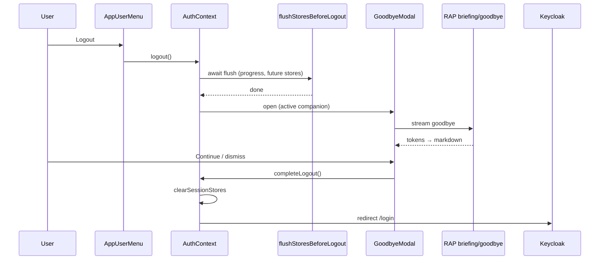

# WIP — Sign-out goodbye (companion farewell + save reassurance)

**Paths:** `apps/web/src/contexts/AuthContext.tsx` · `apps/web/src/components/layout/AppUserMenu.tsx` · `apps/web/src/stores/initializeStores.ts` · `apps/web/src/stores/session/assistantWorkspaceStore.ts` · `apps/web/src/services/rapApi.ts` · `packages/services/rap-service/` (briefing)  
**Related:** `memory/.archive/wip_library-reading-progress.md` ✅ (logout progress flush shipped) · `AssistantBriefing.tsx` (Home greeting cards) · `BriefArtifactModal.tsx`  
**Out of scope:** Keycloak session UX changes · cross-device sync beyond existing persistence stores · legislative cleanup

---

## Status

| | |
|--|--|
| **Phase** | **0** — spec + WIP; partial plumbing shipped |
| **Loop** | 1 |
| **Updated** | 2026-07-21 |
| **Next** | Zach review backdrop layout (arc vs grid) → Phase 1 stage + modal |

---

## Product direction (Zach, 2026-07-21)

Sign-out should feel **intentional and cared-for**, not abrupt:

1. **Reassurance** — user sees that work is saved: *"Current settings and progress saved!"*
2. **Companion farewell** — **active companion** (large, foreground) delivers the goodbye text; **all other user companions** appear as portrait backdrop — the whole party sends you off.
3. **Then redirect** — Keycloak logout after user dismisses (or short auto-continue).

Encourages users to sign out regularly (progress/settings land on server + local persistence is flushed).

---

## Partial shipped (2026-07-21)

| Item | Status |
|------|--------|
| `flushStoresBeforeLogout()` — dirty **reading progress** → S3 | ✅ `initializeStores.ts` + `AuthContext.logout` |
| Teammate library rows show **viewer's** reading % (book club) | ✅ `SavedBooks` / `useLibraryBookProgressPercent` |
| Goodbye modal / RAP endpoint / reassurance copy | ❌ this WIP |

---

## UX flow (target)



**Copy (locked intent):**

- Subtitle / reassurance line: **"Current settings and progress saved!"**
- Foreground: active companion **name** + streamed goodbye (RAP markdown, ≤ ~150 tokens)
- Background: silent portrait gallery of **every other companion** the user owns

---

## Visual layout — **locked (Zach, 2026-07-21)**

Full-viewport or large modal **stage**, not a plain text dialog.

### Layer model

| Layer | Content | Treatment |
|-------|---------|-----------|
| **Backdrop** | All user companions **except** the active one | Small–medium circular portraits; soft blur + reduced opacity (~40–60%); optional slow drift / gentle scale pulse (CSS only) |
| **Hero** | **Active companion** | Large centered portrait (`CompanionAvatarShell`, `intensity="active"`, **not** `contained` — full kit halo); primary visual weight |
| **Speech** | Goodbye stream | Markdown below or beside hero name — reads as the active companion speaking |
| **Chrome** | Reassurance + Continue | *"Current settings and progress saved!"* above or under speech; primary **Continue** → complete logout |

### Composition (recommended v1)

```
┌─────────────────────────────────────────────┐
│  [dim portraits arc / scattered ring]       │
│    ○   ○      ○   ○                         │
│  ○         ┌─────────┐         ○            │
│            │  HERO   │  ← active companion │
│  ○         │ (large) │         ○            │
│    ○       └─────────┘       ○            │
│         "Luna says goodbye…"                │
│         [ streamed markdown ]               │
│   Current settings and progress saved!      │
│              [ Continue ]                   │
└─────────────────────────────────────────────┘
```

- **Background portraits:** 3–12 companions — use `listAssistants()` (`rapApi`); position with CSS grid or absolute `%` slots so count scales (1 companion → hero only, no backdrop clutter).
- **Avatar loading:** reuse `CompanionTableAvatar` / `useAssistantWorkspaceAvatar` per `agentId`; initials fallback when `hasAvatar` false.
- **Active excluded from backdrop** — never duplicate the hero in the ring.
- **Accessibility:** hero has `alt={name}`; backdrop portraits `aria-hidden` decorative; focus trap on Continue.

### Component sketch

- **`GoodbyeModal`** — overlay shell, flush loading state, reassurance copy
- **`GoodbyeCompanionStage`** — backdrop grid + hero + speech slot
- **`GoodbyeCompanionBackdrop`** — maps `companions.filter(c => c.agentId !== active.agentId)` → positioned shells

Existing primitives: `CompanionAvatarShell`, `CompanionInitialsAvatar`, `AssistantBriefing` token stream pattern.

---

## Architecture

### Mirror Home greeting

| Home greeting | Sign-out goodbye |
|---------------|------------------|
| `AssistantBriefing` → `streamBriefingCard({ cardId: 'greeting' })` | `GoodbyeModal` → `streamBriefingCard({ cardId: 'goodbye' })` or dedicated `streamGoodbye()` |
| RAP `POST /rap/assistant/briefing/greeting` | RAP `POST /rap/assistant/briefing/goodbye` (proposed) |
| Persona: active companion IDENTITY/SOUL/MEMORY + inbox | Same persona; prompt = farewell, optional same-day context (books in progress, last focus) |
| Cached per local date | **No cache** or single ephemeral per session (goodbye should feel fresh; Zach to confirm) |

### Active companion + roster source

- **Hero:** `useAssistantWorkspaceStore().activeCompanion` — `agentId`, `name`, `hasAvatar`, `avatarEffect`
- **Backdrop roster:** `listAssistants(accountId, userId)` — same list as My Companions index; filter out active `agentId`
- **Fallback:** no active companion → static farewell + reassurance; if only one companion total, hero-only layout (no backdrop)

### What gets flushed on logout (expand over time)

| Store | Today | Target |
|-------|-------|--------|
| `readingProgressStore` dirty → `updateSavedBook` | ✅ | keep |
| `settingsStore` / other persistence | localStorage already persisted | confirm nothing else needs PUT |
| Session stores | cleared after modal | unchanged |

---

## Implementation phases

### Phase 1 — Modal shell + stage layout (no RAP)

- [ ] `GoodbyeModal.tsx` — overlay, reassurance line, Continue, flush loading
- [ ] `GoodbyeCompanionStage.tsx` — **hero active companion (large)** + **backdrop portraits (all others)**
- [ ] Load companion roster via `listAssistants` on open (cache in modal state)
- [ ] `AppUserMenu.handleLogout` → open modal; Continue → `AuthContext.logout()`
- [ ] Static placeholder speech until Phase 2 stream

### Phase 2 — RAP goodbye stream

- [ ] `BriefType` extend with `'goodbye'` **or** separate API (prefer extend briefing pattern)
- [ ] RAP handler: **active companion persona only** speaks (backdrop is visual — no multi-voice LLM)
- [ ] `streamBriefingCard` endpoint map entry
- [ ] Stream into hero speech area (reuse BriefingCard token UI or slim markdown stream)

### Phase 3 — Polish

- [ ] Backdrop motion polish (subtle CSS drift; respect `prefers-reduced-motion`)
- [ ] Optional speech hook: "you were reading *{title}* at {N}%"
- [ ] Accessibility: focus trap, Escape = continue logout
- [ ] Telemetry / chat-history row for goodbye (billing attribution like greeting)

### Phase 4 — Yield

- [ ] Smoke: logout with dirty reading progress → S3 updated → modal → login page
- [ ] Smoke: 1 companion → hero only; 3+ → backdrop ring visible
- [ ] Smoke: active companion voice matches Home greeting persona

---

## Files (planned)

| Area | Files |
|------|-------|
| UI | `GoodbyeModal.tsx`, `GoodbyeCompanionStage.tsx`, `GoodbyeCompanionBackdrop.tsx`, `AppUserMenu.tsx` |
| Avatars | `CompanionAvatarShell`, `companionAvatar.tsx`, `useAssistantWorkspaceAvatar` |
| Auth | `AuthContext.tsx` (split `prepareLogout` / `completeLogout` if needed) |
| Stores | `initializeStores.ts` (`flushStoresBeforeLogout` — extend) |
| RAP | briefing controller + prompt template for `goodbye` |
| Web API | `rapApi.ts` — `listAssistants`, `BriefType` + endpoint |

---

## Open questions

1. **Cache goodbye?** — Recommend **no daily cache** (each sign-out unique). Zach?
2. **Auto-dismiss** — user must click Continue, or 5s countdown to Keycloak?
3. **Cancel** — allow "Stay signed in" that closes modal without logout?
4. **Mobile** — full-screen stage (hero + backdrop scales down) vs centered modal?
5. **Backdrop layout** — arc ring (recommended) vs scattered grid vs single blurred row?
6. **Other flush targets** — anything besides reading progress that needs PUT before logout?

---

## Zach's Thoughts

> **Zach adds rows here** — raw notes only. **Joshua:** when a note is folded into the body above, prefix that **existing row** with `DONE:` — never add new rows to this section.

- Sign out should tell users **"Current settings and progress saved!"** and have the **active companion wish them goodbye** like the home greeting — modal goodbye generated by assistant.

DONE: Goodbye visual — **active companion large in foreground** (speaking the streamed text); **all other user companion portraits in the background** (soft backdrop ring / gallery). Only the active companion generates speech; backdrop is decorative "whole party sends you off."
