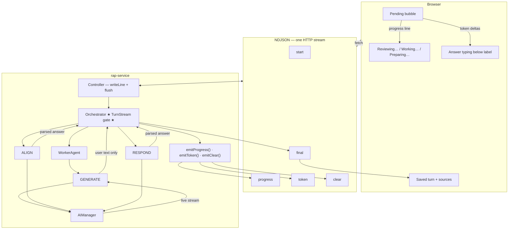

# Assistant Streaming — Architecture & Plan (WIP)

**Goal:** Production-grade assistant UX — feedback starts **within ~1s of Send**, user sees **continuous activity** through long turns (30s+), and **answer text streams in** without junk (no raw JSON, no preview≠final jumps).

**Not locked in:** Progress-only vs token streaming is not a product choice — we want **both**, wired correctly. Progress covers silent phases; tokens cover LLM phases that produce user-facing text.

**Related TODO:** [TODO.md line 12](./TODO.md) — inject process feedback into streaming.

---

## Production-grade target — what “good” looks like

What users experience on Send:

```
0.0s  Pending bubble appears; label: "Reviewing your request…"
~0.5s Still reviewing (INTERPRET running) — not blank, not frozen Send button
~3s   "Working on your request…" (worker / recall / retrieval)
~20s  Answer text begins typing into the bubble (streamed or chunked — see below)
~25s  Stream completes; sources + metadata land; bubble becomes normal saved turn
```

Same **feel** for search, review, conversation, recall — different durations, same event pattern.

### What other platforms do (and what we should copy)

| Pattern | Example | Our equivalent |
|---------|---------|----------------|
| Immediate activity | Status within 1s | `start` + `progress/review` flushed on connect |
| Phase labels during tool/retrieval | “Searching…”, “Reading…” | Generic `progress/work` (mode-agnostic) |
| Typed answer | Token stream | `token` events — **user-facing text only** |
| Single authoritative final | Message + citations at end | `final` with sources; must match streamed answer |
| No internal format leak | Never show JSON/tool payloads | Orchestrator gate — never pass worker callback straight to wire |

### The constraint we have to respect

Not every LLM step outputs user-facing prose **token-by-token**:

| Step | LLM output shape | Streaming approach |
|------|------------------|-------------------|
| Worker **agentic / direct** | Markdown answer | **Real** Bedrock/Ollama stream → orchestrator relays `token` |
| Worker **discover** summarizer | JSON `{ summaries: [...] }` | **Do not stream LLM** — compose formatted list, then chunk `token` |
| **ALIGN** | JSON `{ answer, reasoning }` | **Do not stream LLM raw** — parse, then stream `answer` (chunk or add plain-text stream prompt later) |
| **RESPOND** | JSON `{ answer, reasoning }` | Same as ALIGN |
| **INTERPRET** | JSON routing object | Progress only — never stream |

This is why junk appeared in chat: we streamed LLM bytes **before** the layer that produces user text. Fix is architectural, not a Bedrock bug.

### Production event contract (one pipe, three mid-turn types)

```ts
type AssistantStreamEvent =
  | { type: 'start';    traceId: string }
  | { type: 'progress'; step: 'review' | 'work' | 'prepare'; label: string }
  | { type: 'token';    delta: string }              // user-facing answer chars only
  | { type: 'clear' }                                 // reset bubble before new answer segment
  | { type: 'final';    response: AssistantResponse }
  | { type: 'error';    error: string; traceId?: string }

// REMOVE: preview_start (replaced by progress + optional clear)
```

**Rules (non-negotiable for production):**

1. **Orchestrator is the gate** — nothing reaches the client without passing through `TurnStream`.
2. **`progress` ≠ `token`** — labels during waits; prose during answer delivery.
3. **`final.response.answer` must equal accumulated `token` deltas** (or client clears on `clear` then restreams).
4. **Flush every line** — already in controller; keep it.

---

## Doing it right — we own the pipeline

We control UI → controller → orchestrator → worker → LLM. Streaming should not be hard; it **is** hard today because **no single component owns the client contract** and the worker leaks internal bytes upstream.

**Three rules. Everything else follows.**

| # | Rule | Meaning |
|---|------|---------|
| 1 | **One pipe** | Single `POST /rap/assistant/stream` → NDJSON lines. No worker socket, no second fetch. |
| 2 | **One owner** | **AssistantOrchestrator** is the *only* code that decides what the client sees mid-turn. Worker returns data; it does not talk to the UI. |
| 3 | **One job per event** | Each NDJSON `type` has exactly one purpose. Never reuse `token` for progress or stream internal JSON. |

That is the whole design. Briefing cards already follow rule 2 (service streams via a handler the controller owns). Chat broke rule 2 by passing `onToken` straight through to the worker.

---

## Cog diagram — TODAY (loose)

```mermaid
flowchart TB
  subgraph UI["Browser"]
    Chat["chat/index.tsx"]
    RapApi["rapApi.ts"]
    Chat --> RapApi
  end

  subgraph Wire["NDJSON pipe — one HTTP stream"]
    E1["start"]
    E2["preview_start"]
    E3["token ⚠️"]
    E4["final"]
  end

  subgraph RAP["rap-service — same Node process"]
    Ctrl["AssistantController<br/>writes whatever callbacks fire"]
    Orch["AssistantOrchestrator<br/>partial owner"]
    Worker["WorkerAgent<br/>PREPARE → ASSEMBLE → GENERATE"]
    LLM["AIManager / Bedrock"]

    Interpret["INTERPRET 🔇"]
    Align["ALIGN 🔇"]
    Respond["RESPOND 🔇"]
  end

  RapApi <-->|"fetch stream"| Wire
  Wire <-- Ctrl
  Ctrl -->|"onToken, onPreviewStart"| Orch

  Orch --> Interpret
  Interpret -.->|"no events"| Wire

  Orch -->|"work mode only"| E2
  Orch -->|"passes onToken through ❌"| Worker
  Worker --> LLM
  LLM -->|"live tokens"| Worker
  Worker -->|"same callback ❌"| E3

  Orch -->|"fake-chunk rawAnswer ❌"| E3
  Orch --> Align
  Align -.->|"silent; answer only in final"| E4

  Orch --> Respond
  Respond -.->|"silent then fake-chunk ❌"| E3

  E3 -.->|"discover: raw JSON"| Chat
  E4 --> Chat
```

**What's loose (red flags on the diagram):**

| Cog | Problem |
|-----|---------|
| **Worker → `token`** | Bypasses orchestrator intent; discover sends JSON; agentic sends preview that ≠ ALIGN final |
| **INTERPRET / ASSEMBLE / ALIGN / RESPOND** | Long silent gaps — no wire events |
| **`preview_start`** | Work-only, fires late; conflated with "progress" |
| **`onClear`** | Wired end-to-end, **never emitted** |
| **Controller** | Dumb forwarder — no contract enforcement |
| **Two meanings of `token`** | Progress-ish preview + answer content + internal JSON |

---

## Cog diagram — TARGET (production)



**Key difference from today:** Worker → LLM → **orchestrator filters** → wire. Never Worker → wire direct.

---

## Side-by-side — who emits what

```
TODAY                              TARGET (v1)
─────────────────────────────────  ─────────────────────────────────
Controller                         Controller
  onToken ← orchestrator/worker      TurnStream ← orchestrator ONLY
  onPreviewStart ← work only         progress / final / error

Orchestrator                       Orchestrator
  preview_start (work)               progress: review → work? → prepare
  forwards worker onToken ❌         worker.run() — no client callbacks
  fake-chunks answer ❌              final.answer = aligned/respond output
  silent INTERPRET/ALIGN             emit at every await boundary

Worker                             Worker
  GENERATE → onToken → UI ❌         GENERATE → internal LLM stream OK
  discover → JSON to UI ❌           returns { answer, sources, … }

UI                                 UI
  token buffer + preview mode        progress label (muted, replace)
  final ≠ preview text               final = only answer source
```

---

## Event protocol — the only things on the wire

Shared type (add to `packages/services/rap-service` + `apps/web`):

```ts
// Mid-turn events — strict jobs
type AssistantStreamEvent =
  | { type: 'start';   traceId: string }
  | { type: 'progress'; step: 'review' | 'work' | 'prepare'; label: string }
  | { type: 'token';   delta: string }   // Phase 2+ only; orchestrator-emitted user text
  | { type: 'final';   response: AssistantResponse }
  | { type: 'error';   error: string; traceId?: string }

// DEPRECATE in v1: preview_start, clear (remove from controller + UI)
```

| Event | Owner | When | UI behavior |
|-------|-------|------|-------------|
| `start` | Controller | First line | Optional: ensure pending bubble visible |
| `progress` | Orchestrator | Before each major `await` | Replace muted label in pending bubble |
| `token` | Orchestrator | Phase 2+: user-facing text only | Append below progress (optional) |
| `final` | Controller | Turn complete | Clear pending; save turn; render markdown |
| `error` | Controller | Catch block | Toast + clear pending |

**v1:** `progress` + `final` only. No `token` on the wire.

---

## Orchestrator turn map — same pattern, every mode

Every mode walks the **same three steps** (skip instant steps; never skip `review`):

```
                    ┌─────────────────┐
                    │ progress/review │  ← immediately after start
                    └────────┬────────┘
                             │
              ┌──────────────┼──────────────┐
              │              │              │
         conversation    clarify      recall / work
              │              │              │
              │              │         ┌────▼────┐
              │              │         │progress/│
              │              │         │  work   │
              │              │         └────┬────┘
              └──────────────┼──────────────┘
                             │
                    ┌────────▼────────┐
                    │progress/prepare │  ← ALIGN | RESPOND | clarify | direct
                    └────────┬────────┘
                             │
                    ┌────────▼────────┐
                    │     final       │
                    └─────────────────┘
```

| Mode | `review` | `work` | `prepare` | Answer source |
|------|----------|--------|-----------|---------------|
| work | INTERPRET | `workerAgent.run()` | ALIGN | `final.response.answer` |
| recall | INTERPRET | recall lookup | RESPOND (if not verbatim) | `final` |
| conversation | INTERPRET | — (skip or flash) | RESPOND | `final` |
| clarify | INTERPRET | — | build clarify question | `final` |
| direct/greet | INTERPRET | — | direct answer | `final` |

Labels are **always** the same three strings. Timing differs; copy never does.

---

## What we need to build (production checklist)

This is **one project**, not progress-then-streaming. Estimated ~2–3 focused days.

### Layer 1 — Contract + gate (foundation)

| Task | Why |
|------|-----|
| Add `TurnStream` type + shared `AssistantStreamEvent` (rap-service + web) | Single source of truth; stop parsing `any` |
| Controller creates `TurnStream` → passes to orchestrator | Thin writer only |
| Orchestrator `emitProgress` at **every** await boundary, all modes | Feedback <1s after Send |
| Remove `preview_start`, worker-direct `onToken`, fake-chunk loops | Stops junk and duplication |

### Layer 2 — Answer streaming (the typing effect)

| Task | Stream type | Where |
|------|-------------|--------|
| Worker agentic/direct | **Real** LLM `onToken` → worker collects → **orchestrator relays** to `emitToken` | `GenerateService` / `AgenticCallExecutor` — callback to orchestrator, not controller |
| Worker discover | **Post-compose chunk** — `DiscoveryFormatter.composeSummarizedAnswer()` then `emitToken` in slices | `handleWork` after worker returns |
| ALIGN (work + persona) | **Post-parse chunk** — parse JSON, stream `answer` field; `emitClear` first if replacing worker text | `AlignService` returns answer → orchestrator chunks |
| RESPOND (conversation / recall) | **Post-parse chunk** or wire `onToken` if we add plain-text stream prompt | `RespondService` |
| Recall verbatim | Chunk recalled `answer` | `handleRecallDelivery` |

**Work mode stream strategy (pick one — recommend A):**

| | Strategy | UX | Complexity |
|---|----------|-----|------------|
| **A** | Progress during worker; stream **only final** text (post-ALIGN or raw if ALIGN skipped) | No preview/final mismatch | Low |
| **B** | Stream worker during agentic; `clear` + stream ALIGN answer | More “live” but two-phase | Medium |
| **C** | Stream worker always; skip ALIGN stream when persona off | Inconsistent | Avoid |

**Recommend A for production v1** — matches “one continuous answer” feel; progress covers the long worker wait.

### Layer 3 — UI (dumb, reliable)

| Task | Detail |
|------|--------|
| `onStart` / first `progress` → show pending bubble immediately | Already almost there via `setPendingAssistantMessage('')` |
| `progress` → muted label, **replace** not append | One line above answer area |
| `token` → append to answer area below label | Plain text while streaming; markdown on `final` |
| `clear` → reset answer buffer, keep progress label | For strategy B |
| `final` → verify answer matches buffer; save turn; clear pending | Sources render from `final` only |
| Send button → mirror current `progress.label` | Replace “Thinking…” |
| Drop `isPreviewMode` | Replaced by progress + token layout |

### Layer 4 — Production hardening

| Task | Detail |
|------|--------|
| Disconnect mid-stream | Client abort → server write errors ignored (already partial) |
| Stream fallback | Keep `POST /rap/assistant` non-stream + typewriter (already exists) |
| Integration test | Assert event order: `start` → `progress/review` → … → `final` for each mode |
| Logging | Log progress step transitions with `traceId` (debug 30s turns) |

### Layer 5 — Optional polish (not blocking ship)

| Task | Detail |
|------|--------|
| Real-time ALIGN/RESPOND stream | Change prompts to plain-text when streaming; parse at end — avoids chunk-after-wait |
| Elapsed time on `work` step | `(12s)` suffix after 5s |
| Agentic tool-call progress | Extra `progress` sub-steps — only if generic 3-step feels too coarse |

---

## Per-mode event timeline (production)

Generic labels everywhere; **tokens** only on rows marked 📝.

**Work (search / review / analysis):**
```
start → progress/review → progress/work → [optional: token 📝 if strategy B agentic]
      → progress/prepare → token 📝 (aligned or raw answer) → final
```

**Conversation:**
```
start → progress/review → progress/prepare → token 📝 (RESPOND) → final
```

**Recall (verbatim):**
```
start → progress/review → progress/work → token 📝 (recalled answer) → final
```

**Recall (with RESPOND rewrite):**
```
start → progress/review → progress/work → progress/prepare → token 📝 → final
```

**Clarify:**
```
start → progress/review → progress/prepare → token 📝 (question) → final
```

---

## Is this too hard?

**No.** We already have:

- NDJSON stream endpoint + flush ✅  
- Bedrock/Ollama token streaming in `ai-client` ✅  
- Briefing cards streaming end-to-end ✅  
- Pending bubble UI ✅  

What we **don’t** have (and why it feels broken):

- Orchestrator gate ❌  
- Progress events ❌  
- Streaming only **user-facing** layers ❌  
- ALIGN/RESPOND/discover treated like agentic prose ❌  

That is ~6 files backend, ~3 files frontend, 1 shared type — not a platform rewrite.

**Fallback if timeline slips:** Ship Layer 1 only (progress + final, no tokens) — still fixes 30s silence and JSON junk. Layer 2 adds typing in a follow-up PR without changing the contract.

---

## Reference — one pipe (no second HTTP stream)

```
Browser  ──POST /rap/assistant/stream──►  rap-service  ──NDJSON──►  Browser
```

Worker is **in-process** (`workerAgent.run()`). The only stream to the browser is the controller's NDJSON response.

---

## End-to-end path (UI → PA → Worker → UI)

### 1. UI sends the request

**File:** `apps/web/src/pages/dashboard/chat/index.tsx`

User hits Send → builds `AssistantChatRequest` → calls `chatWithAssistantStream()`.

While waiting:
- Send button shows **"Thinking..."** (`ChatInput.tsx`) — generic, not phase-aware.
- A **pending assistant bubble** appears once streaming starts (`pending-assistant` message id).

**File:** `apps/web/src/services/rapApi.ts`

- `fetch(POST …/rap/assistant/stream)`
- Reads `resp.body` with a `ReadableStream` reader
- Parses **newline-delimited JSON** (one event per line)
- Dispatches to handlers: `onToken`, `onPreviewStart`, `onClear`, `onFinal`, `onError`

### 2. Controller opens the single NDJSON pipe

**File:** `packages/services/rap-service/src/controllers/AssistantController.ts`

```
writeLine({ type: 'start', traceId })
await orchestrator.run(request, {
  onToken:        (delta) => writeLine({ type: 'token', delta }),
  onPreviewStart: ()     => writeLine({ type: 'preview_start' }),
  onClear:        ()     => writeLine({ type: 'clear' }),
})
writeLine({ type: 'final', response })
res.end()
```

**Current NDJSON event types:**

| Event | When | UI effect today |
|-------|------|-----------------|
| `start` | Request accepted | (ignored by frontend) |
| `preview_start` | Work mode, before worker | `isPreviewMode = true` → muted italic bubble |
| `token` | Content delta | Appends to `pendingAssistantBufferRef` → pending bubble |
| `clear` | (rare) | Clears pending bubble |
| `final` | Turn complete | Returns full `AssistantResponse`; UI saves turn, clears pending |
| `error` | Failure | Error handler |

**Planned but not implemented:** `align_start` (comment in controller).

### 3. Assistant orchestrator (same request, no network hop)

**File:** `packages/services/rap-service/src/services/assistant/AssistantOrchestrator.ts`

Single `run()` → `runTurn()` with optional `StreamCallbacks`:

```ts
interface StreamCallbacks {
  onToken?:        (delta: string) => void;
  onPreviewStart?: () => void;
  onClear?:        () => void;
}
```

**Turn sequence (always synchronous await chain in one HTTP request):**

```
load workspace + chat history
    │
    ▼
INTERPRET (LLM)                    ◄── silent — no onToken
    │
    ├── recall hit? ──► handleRecallDelivery     ◄── fake-chunk at end only
    ├── clarify?    ──► handleClarify            ◄── no streaming
    ├── work?       ──► handleWork               ◄── main streaming path
    ├── conversation? ► handleConversation       ◄── fake-chunk at end only
    └── else        ──► handleDirect             ◄── fake-chunk at end only
```

### 4. Work mode — where most streaming happens

**File:** `AssistantOrchestrator.handleWork()`

```
onPreviewStart()                          ──► NDJSON preview_start ──► UI preview bubble
    │
    ▼
workerAgent.run(intent, { onToken, onClear })   ◄── IN-PROCESS CALL (not HTTP)
    │
    ▼
if rawAnswer: re-chunk rawAnswer → onToken   ◄── duplicate stream if GENERATE already streamed
    │
    ▼
align.run(rawAnswer)                      ◄── silent — polished answer only in `final`
    │
    ▼
return AssistantResponse                  ──► NDJSON final
```

**Important:** `onPreviewStart` fires **after** INTERPRET completes, not at request start. User sees "Thinking..." through all of INTERPRET with no bubble update.

### 5. Worker agent — in-process pipeline, one shared onToken callback

**File:** `packages/services/rap-service/src/services/workers/WorkerAgent.ts`

```
WorkerAgent.run(intent, { onToken, onClear })
    │
    ├── PREPARE   (skill load, plan)     ◄── silent
    ├── ASSEMBLE  (vector search, discovery prefetch)  ◄── silent (often longest gap)
    ├── GENERATE  (LLM)                  ◄── onToken passed through (mode-dependent)
    ├── VALIDATE  (confidence)           ◄── silent
    └── compose response                 ◄── silent
```

**File:** `packages/services/rap-service/src/services/generate/GenerateService.ts`

`onToken` routing by `plan.generate.mode`:

| Mode | onToken wired to | What actually streams |
|------|------------------|------------------------|
| **discover** | `DiscoverySummarizer` → LLM `generate()` | **Raw JSON** from summarizer LLM (`{"summaries":[…]}`) — **BUG** |
| **agentic** | `AgenticCallExecutor` → LLM tool loop | Live answer tokens (correct) |
| **direct** | `AgenticCallExecutor.generate()` | Live answer tokens (correct) |

After discover LLM returns, server parses JSON and runs `DiscoveryFormatter.composeSummarizedAnswer()` — **formatted list never streams**, only appears in worker `answer` → `final`.

### 6. What the UI actually renders

**File:** `apps/web/src/pages/dashboard/chat/index.tsx`

- `onToken`: buffer + 50ms debounce → `setPendingAssistantMessage`
- `onPreviewStart`: `setIsPreviewMode(true)`
- On `final`: pending bubble cleared; saved turn uses `response.answer` (aligned / final)

**File:** `apps/web/src/components/chat/ChatMessage.tsx`

Pending assistant bubble (**v1 target**):
- **Progress only** — gray italic single line, e.g. *Working on your request…* (replaces on each `{ type: "progress" }`)
- Optional dots while waiting
- **Final answer** — normal markdown bubble after `final` (not streamed token-by-token in v1)

Legacy behavior (to remove in Phase 2):
- Preview + content → gray italic raw worker/discover JSON (bug)
- Streaming + content → plain text tokens from worker `onToken`

---

## Diagram — one pipe, callback chain

```
┌─────────────────────────────────────────────────────────────────────────────┐
│  Browser (chat/index.tsx)                                                   │
│    chatWithAssistantStream ── fetch POST /rap/assistant/stream              │
│    ReadableStream ◄── NDJSON lines ─────────────────────────────────────── │
└─────────────────────────────────────────────────────────────────────────────┘
                                      │
                                      ▼
┌─────────────────────────────────────────────────────────────────────────────┐
│  AssistantController.chatStream                                             │
│    writeLine({type:'token', delta}) ◄── onToken callback                    │
└─────────────────────────────────────────────────────────────────────────────┘
                                      │
                                      ▼
┌─────────────────────────────────────────────────────────────────────────────┐
│  AssistantOrchestrator                                                      │
│    INTERPRET ──► (recall | clarify | work | conversation | direct)        │
│                                                                               │
│    handleWork:                                                                │
│      onPreviewStart() ─────────────────────────────► preview_start          │
│      workerAgent.run(intent, { onToken })  ────┐                             │
│      post-worker re-chunk(rawAnswer) ─ onToken │                             │
│      align.run() ─ silent                      │                             │
└────────────────────────────────────────────────┼─────────────────────────────┘
                                                 │ same function ref
                                                 ▼
┌─────────────────────────────────────────────────────────────────────────────┐
│  WorkerAgent (in-process, same Node request)                                │
│    PREPARE → ASSEMBLE → GENERATE(onToken) → VALIDATE → compose             │
│                              │                                                │
│                              ▼                                                │
│                    GenerateService / DiscoverySummarizer / AgenticCall      │
│                              │                                                │
│                              ▼                                                │
│                    AIManager → Bedrock/Ollama stream                       │
└─────────────────────────────────────────────────────────────────────────────┘
```

**There is no assistant↔worker socket.** The "pipe" between them is `options?.onToken` passed as a function argument.

---

## Why it feels broken today

| Symptom | Cause |
|---------|--------|
| Long "Thinking..." before anything | INTERPRET + (work) PREPARE + ASSEMBLE emit **zero** NDJSON events |
| Raw JSON in chat (bicycle search) | Discover mode streams **summarizer JSON** via `onToken`, not formatted output |
| Preview then jump to different text | Worker streams raw/partial → `final` delivers **ALIGN**-polished answer with no `align_start` |
| Conversation feels non-streaming | `RespondService.respond()` awaits full LLM response, then orchestrator **fake-chunks** at end |
| Recall feels instant dump | Same fake-chunk pattern after recall lookup |
| Double content in work mode | GENERATE may stream tokens **and** orchestrator re-chunks full `rawAnswer` after worker returns |

---

## Proposed work (phased)

### Phase 1 — Progress feedback (primary deliverable)

**Problem:** 30s+ of "Thinking…" with no in-bubble feedback. Mode-specific labels would be brittle across skills (search vs review vs analysis vs conversation).

**Approach:** PA orchestrator emits **three universal steps** on every turn. Same labels regardless of mode; orchestrator advances the step at known await boundaries. Steps may be instant on fast paths — that is fine.

| Step | `step` id | Label | Emit when (orchestrator) | Applies to |
|------|-----------|-------|--------------------------|------------|
| 1 | `review` | Reviewing your request… | Stream start, before INTERPRET | **all modes** |
| 2 | `work` | Working on your request… | Before worker / recall lookup / any long middle phase | work, recall, (brief flash for conversation if we want a consistent cadence) |
| 3 | `prepare` | Preparing your answer… | Before ALIGN, RESPOND, clarify build, or direct-answer finalize | **all modes that produce an answer** |

**Why only three:** Covers the full turn without naming skills or worker internals. "Working on your request…" covers PREPARE + ASSEMBLE + GENERATE + recall retrieval — the whole middle gap. "Preparing your answer…" covers ALIGN, RESPOND, and persona polish. No label breaks when skill is `legislative-review` vs `legislative-search`.

**Per-mode walkthrough (same labels, different timing):**

```
conversation:  review ──► prepare ──► final
clarify:       review ──► prepare ──► final
recall:        review ──► work ──► prepare ──► final   (work = recall lookup; prepare = optional RESPOND)
work:          review ──► work ──► prepare ──► final   (work = entire workerAgent.run; prepare = ALIGN)
direct/greet:  review ──► prepare ──► final
```

**NDJSON event:**

```json
{ "type": "progress", "step": "review", "label": "Reviewing your request…" }
```

**Backend:**
- `StreamCallbacks.onProgress(step, label)` — small helper called from orchestrator only (not worker).
- `AssistantController` → `writeLine({ type: 'progress', step, label })`.
- Emit `progress/review` immediately after `{ type: 'start' }` so the bubble updates before INTERPRET.
- **Do not** forward `workerAgent.run({ onToken })` to the client in v1 (or pass `undefined` for onToken).

**Frontend (muted display — existing preview styling):**
- Show pending assistant bubble as soon as stream starts (not only on `preview_start`).
- **Progress line:** gray italic, single line — current `label` replaces previous (not appended).
- Optional subtle dots beside the label while waiting.
- **No answer text** in pending bubble until `final` — avoids JSON leak, ALIGN mismatch, and duplicate re-chunks.
- On `final`: clear progress; render saved turn with normal markdown.

**Files:** `AssistantController.ts`, `AssistantOrchestrator.ts`, `rapApi.ts`, `chat/index.tsx`, `ChatMessage.tsx`.

---

### Phase 2 — Stop worker content on the UI pipe (bundled with Phase 1)

**Problem:** Discover mode streams raw summarizer JSON; work mode may double-stream and preview ≠ final.

**Change (aligned with progress-first):**
- Orchestrator stops passing `streaming.onToken` into `workerAgent.run()`.
- Remove post-worker fake-chunk loop in `handleWork`.
- Remove fake-chunk in `handleConversation`, `handleRecallDelivery`, `handleDirect` (answer only in `final`).

Worker LLM streaming can remain internal for future use; it just does not go to the client.

**Files:** `AssistantOrchestrator.ts` (primary); optionally clean up `DiscoverySummarizer` onToken wiring.

---

### Phase 3 — Optional later: content token streaming

Only if we want ChatGPT-style typing after progress UX is solid:

- Stream formatted discover output (post-formatter), not summarizer JSON.
- Stream RESPOND / conversation tokens during `prepare` step (progress label stays; tokens append below).
- Stream ALIGN output (currently `final`-only).

**Not in v1.** Progress solves the 30s wait problem without this complexity.

---

### Phase 4 — UI polish (optional)

- Mirror current progress label on Send button (replace "Thinking…").
- Elapsed seconds on step 2 if `work` exceeds ~5s (same generic label, optional "(12s)" suffix).
- Fade progress line when `final` arrives.

---

## Pushback / tradeoffs (brief)

**Agree:** Progress-first is easier and more valuable than wiring worker `onToken` for PolicyCommand. Orchestrator-only progress avoids skill-specific copy and works for all modes.

**Tradeoff:** Users will not see partial answer text during the worker phase — only step labels, then the full formatted answer. That is intentional for v1. If we later want typing indicators for conversation, add token streaming under the progress line without changing the step model.

**Do not do:** Per-skill status labels, worker PREPARE/ASSEMBLE/GENERATE sub-labels in v1, or mixing progress into the `token` pipe — all add brittleness or conflate status with answer text.

---

## Open questions for approval

1. **Three universal steps OK?** (`review` → `work` → `prepare`) — or prefer two (`review` → `prepare`) for conversation/clarify with no middle step?
2. **Pending bubble:** Progress only until `final` (recommended) vs allow optional token text below progress in a later phase?
3. **Send button:** Mirror progress label or keep generic "Working…"?

---

## Key files reference

| Layer | File |
|-------|------|
| UI send + pending bubble | `apps/web/src/pages/dashboard/chat/index.tsx` |
| UI stream parser | `apps/web/src/services/rapApi.ts` |
| UI message render | `apps/web/src/components/chat/ChatMessage.tsx` |
| UI send button | `apps/web/src/components/chat/ChatInput.tsx` |
| NDJSON endpoint | `packages/services/rap-service/src/controllers/AssistantController.ts` |
| PA turn + callbacks | `packages/services/rap-service/src/services/assistant/AssistantOrchestrator.ts` |
| Worker pipeline | `packages/services/rap-service/src/services/workers/WorkerAgent.ts` |
| GENERATE routing | `packages/services/rap-service/src/services/generate/GenerateService.ts` |
| Discover JSON bug | `packages/services/rap-service/src/services/generate/DiscoverySummarizer.ts` |
| Conversation LLM | `packages/services/rap-service/src/services/assistant/RespondService.ts` |
| LLM streaming primitive | `packages/services/rap-service/src/utils/AIManager.ts` → `packages/shared/ai-client/` |

---

## Approval checklist

- [ ] **Target:** Immediate progress + streamed/chunked answer text + clean `final` (production grade)
- [ ] **Gate:** Orchestrator-owned `TurnStream`; worker never writes wire directly
- [ ] **Work mode strategy A:** Progress during worker; stream post-ALIGN answer only
- [ ] **JSON LLM steps:** Stream composed/parsed user text only (discover, ALIGN, RESPOND)
- [ ] **Fallback OK:** Layer 1-only ship if needed; Layer 2 follows without contract change
- [ ] Ready to implement
