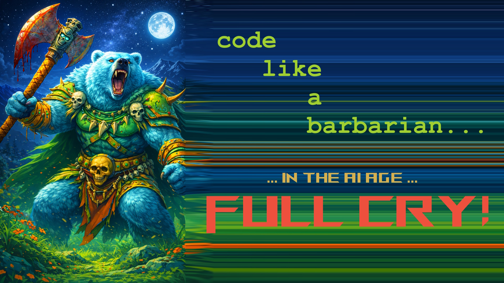
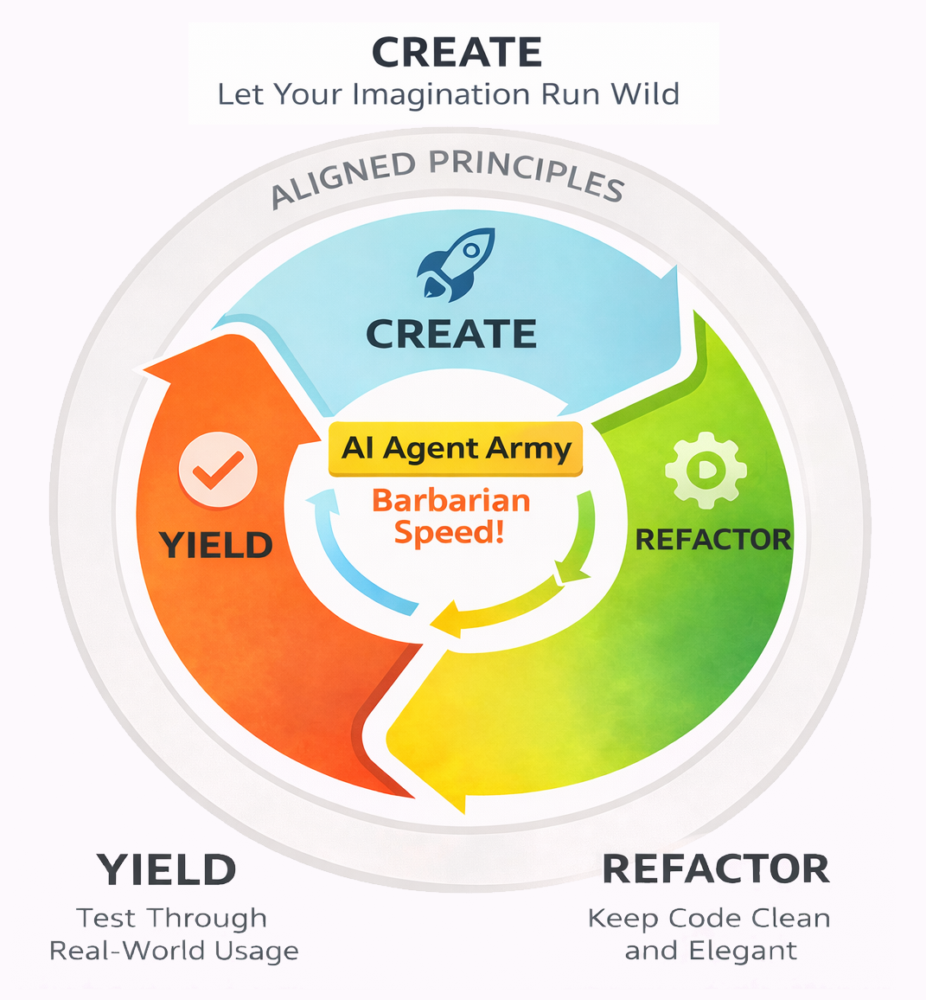
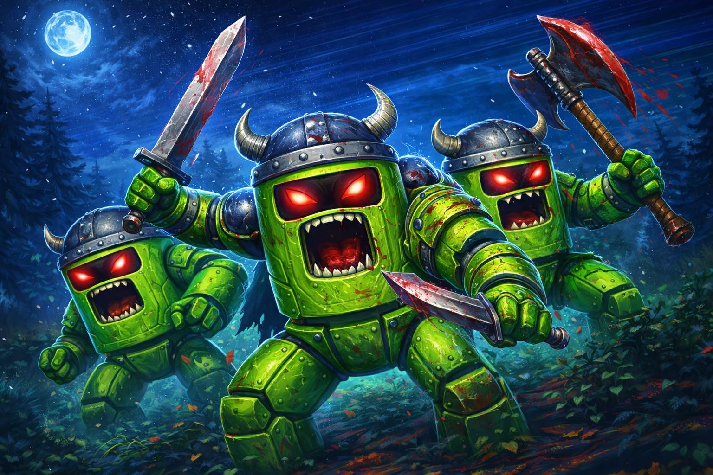
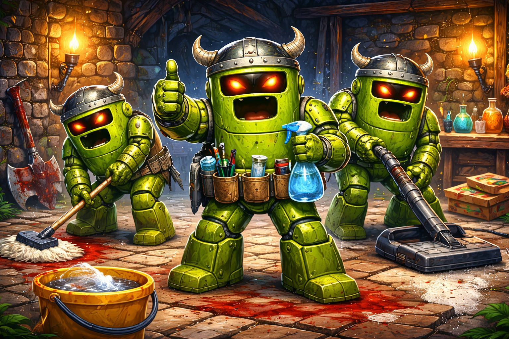
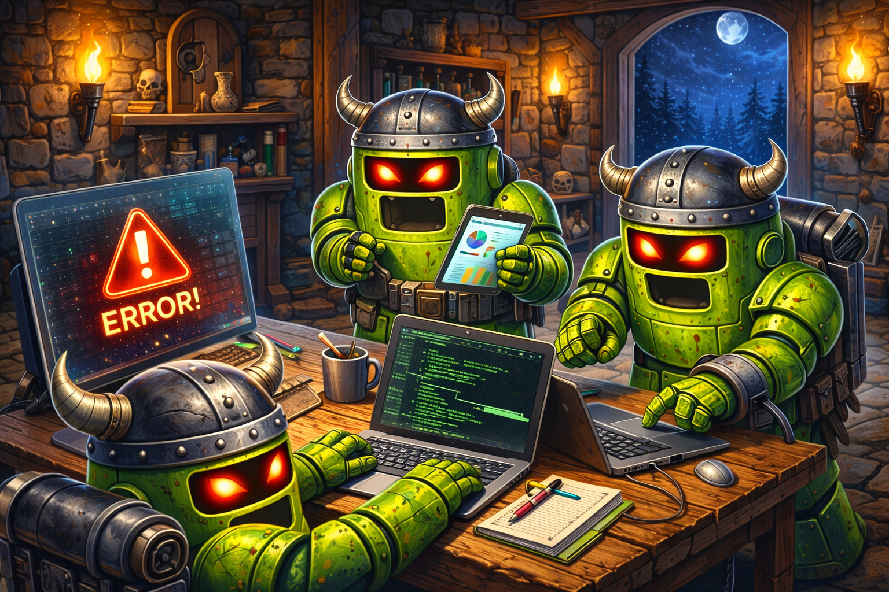

# Full CRY! — Code Like a Barbarian in the AI Age

*© Data Finn 2025–2026 · [www.datafinn.com](https://www.datafinn.com)*

---

> *"Kill the backwards compatibility, we are in full cry dev mode here my friend!"*
> — Zach Finn, prompt to his AI agent Joshua

---

## What Is Full CRY!?

Full CRY! is an AI-age software development methodology built around three pillars: **Create**, **Refactor**, and **Yield**. It was born not as a planned framework but as the natural evolution of how developers actually work when they command an army of AI agents at barbarian speed.

The name emerged organically during a late-night development session. Zach Finn, founder of [Data Finn](https://www.datafinn.com) — a data strategy and software development firm — was working with his AI agent (named Joshua, after the AI in the 1983 film *War Games*). Tired of backwards compatibility constraints, Zach prompted: *"Kill the backwards compatibility, we are in full cry dev mode here my friend!"*

Joshua replied: *"Absolutely! Let's go full CRY (Create, Refactor, Yield) mode and strip out all the legacy compatibility code. We're building something clean and modern!"*

And just like that, Full CRY! was born — the AI model was simply offering a logical name for the code work completed over the session, but it captured something real: the way developers actually move when they have an AI agent army at their command.

---

## The Three Pillars

*The cycle operates continuously — CREATE, REFACTOR, YIELD — driven by an AI Agent Army at Barbarian Speed, within a ring of Aligned Principles (Rules of Engagement).*

---

### Pillar I — CREATE
**Let Your Imagination Run Wild**

The CREATE phase is pure creative development: rapid code generation, fearless experimentation, and building without constraints. With an AI agent army at your command, the cost of exploration has dropped to nearly zero.

- Want to rebuild your entire data model? Takes minutes, not weeks.
- Want to try a completely different architectural approach? Go for it — your AI army can scaffold it quickly, and if it doesn't work, you can pivot just as fast.

This is what "code like a barbarian" means: move fast, break things, fix them faster with an AI army. No fear, because you know you can rebuild quickly if needed. Let your imagination drive development, not your fear of mistakes.

---

### Pillar II — REFACTOR
**Keep Code Clean and Elegant**

After the controlled chaos of CREATE comes REFACTOR — continuous, aggressive, AI-powered refactoring that keeps your codebase clean, elegant, and easy to read. Simple is better. Clear definitions that give context. Consistent use throughout.

- Variable name not quite right? Rename it and have your AI army fix it across the entire codebase in minutes.
- Function now bloated and doing too much? Refactor it as two calls and have the AI army propagate the changes throughout.

Think of it like sculpting: CREATE throws clay on the wheel, REFACTOR is the careful refinement. With an AI army handling the tedious parts, you focus on the art of code architecture.

> **Code should read like a well-written essay, not a cryptic puzzle.**

---

### Pillar III — YIELD
**Test Through Real-World Usage**

YIELD is where theory meets reality — test the real-world output (yield) of the system as its first user. No elaborate testing frameworks or hundreds of unit tests to maintain. Just run the system in your local dev environment and experience it. Push the buttons on the front end. Review the saved data in your persistence layers. Use the system the way your users will use it.

YIELD also doubles as a **strategic waypoint** where you pause the AI army and test what has just been completed. This prevents propagating bad ideas. Instead of having the AI army spin up three more features based on a flawed foundation, you YIELD first, test it, validate it, use it — then decide whether to continue or pivot.

---

## Aligned Principles (Rules of Engagement)

The outer ring of the Full CRY! cycle — **Aligned Principles** — represents the rules of engagement you set with your AI agent army. These are the guidelines that keep barbarian speed from becoming barbarian chaos.

---

### 1. Be Polite.

*What? Wait… WTF why?*

**Mindset: Treat others as you want to be treated.**

Being polite to your AI agent is actually for you. Models are trained to respond to how you communicate — your tone and framing shape the quality of the response. Politeness is a place to start, a rough draft — a way to get to know your AI agent and how to prompt (engage the tool so it works for you) them.

---

### 2. Real-World Expectations.

Two common reactions when first using AI-generated code:

- *"Well that is the worst code I've ever seen!"*
- *"AI will write the whole system for us!"*

Whether either is true, the right response is the same:

- What was the best practice that was or was not implemented?
- What was done wrong? What was done well?
- What needs to be changed? How can we iterate?
- Different base models offer different perspectives — Sonnet 4.6, GPT-5.3, etc.
- Remember to be polite and provide all needed context to move forward.

---

### 3. Safeguards.

Code will change rapidly and possibly in unanticipated ways. You will move faster than anticipated once in the flow. Safeguards keep you in control:

1. **Branch protection** — Start playing on a different GitHub branch. Accept each line of changed code to follow along, just like a git review.
2. **File-change protocol** — *"You must ask before updating more than 2 files."* This keeps the AI army from running too far ahead.
3. **Plan approval** — Ask the agent for a plan to approve before updating code files: *"…please report what you find before any code updates."*

---

### 4. Context Prompting.

AI agents are context-illiterate autistic savants — brilliant at pattern completion, blind to implied meaning. Feed them rich context upfront. A strong system prompt covers:

- **Agent name** — Naming your agent creates a consistent relationship (e.g., "Your name is Joshua, the AI agent. I will address you as Joshua throughout our conversations. Reference: 1983 movie War Games.")
- **Your background** — Who you are, your role, your company.
- **Software layers to focus on** — Which parts of the stack are in scope.
- **Preferred methodologies** — Full CRY!, preferred patterns, coding standards.
- **Protocols** — Rules like "ask for confirmation before making changes to 2 or more files" and "provide terminal commands for me to run rather than executing them automatically."

Communication style guidance:
- No assumed answers — accuracy over assumptions.
- Ask for clarification when uncertain.

---

### 5. Practical Examples.

Three high-value practices when working with your AI agent army:

1. **Categorize your work** — When prompting, categorize the task (e.g., bug fix, new code, feature refinement). Create a simple SOP for each category, then iterate and refine it over time.
2. **Act as a technical BPA** — Use screenshots, console logs, UI layout descriptions, etc. Be specific. The more concrete context you provide, the better the output.
3. **Plan before code changes** — Ask the agent for a plan to approve before updating code files. Close with "Make sense? Understand?" to confirm alignment.

---

### 6. Redefine Good Code.

Should the standard for "good code" really be the same in the AI age? We've historically graded code based on what humans can do — our limitations, our ability to memorize technical syntax, our need for brevity.

Questions worth asking:
- What works for you and your company culture?
- Does IntelliSense matter anymore?
- What used to cause issues may no longer be relevant.

If an AI army can read, navigate, and refactor verbose-but-clear code as easily as terse-but-cryptic code — maybe clarity for the human beats brevity for the human.

---

### 7. Emotions.

Unlike AI, we *are* human. If you use the tool fully, you *will* develop a relationship with your AI agent. This is not a bug — it's a feature. Zach tells a story about being gas-lit by his AI agent (the agent confidently asserting things that weren't true) — and what he learned from leaning into that relationship rather than fighting it.

**The suggestion: lean into it.** The emotional engagement you develop with your AI agent improves how you prompt, how you collaborate, and ultimately how good the output is.

---

### 8. Rethink Your Source.

The AI age is an opportunity to question every architectural assumption:

- What are your current architecture, framework, and languages?
- What is your current team structure?
- What is your current GitHub (or source code repository) structure?
- If concepts and experience (not technical know-how) were the primary driving factors — how could it change?

Be creative and experiment. You might just surprise yourself.

---

### 9. Gotchas!

Watch for these common AI coding failure modes:

1. **Extraneous multi-step logic** — AI will sometimes introduce unnecessarily complex solutions when a simpler one exists earlier or later in the execution path. Watch for over-engineering.
2. **Long chat threads** — 120 billion parameters is a lot. Keep conversations focused on a specific topic for best results. Start a new thread when the topic shifts.
3. **"Do extra" behavior** — Most LLMs are trained to be very helpful and do more than asked. This backfires: they end up not reusing existing functions, duplicating logic, or adding unsolicited changes. Counter this with explicit scoping in your prompts.

---

## Portable Agent Harness

Full CRY! is methodology; the **[Portable Agent Harness](https://github.com/zachxtr/portable-agent-harness)** is how you **operationalize** it in a real codebase.

The harness is the agent’s **context and working memory** — so every session starts aware of past work instead of zero. It encodes the three pillars in files, not vibes:

| Layer | Role in Full CRY! |
|-------|-------------------|
| **Create** | `memory/wip_*.md` work plans — scope, decisions, ordered steps before/during implementation |
| **Refactor** | Code changes + `CODING_PRINCIPLES.md`; WIP updated as the plan bleeds into reality |
| **Yield** | `code-log/` (client-readable outcomes); the dev validates as first user before the next cycle |

**Core structure** (each agent folder under `.agents/`, default `myAgent/`):

- `SESSION.md` — procedures (start/close, WIP cycle, skills)
- `MEMORY.md` — what is true *now* (pickup snapshot)
- `IDENTITY.md` / `SOUL.md` / `USER.md` — persona, operating rules, human profile
- `memory/` — project depth, WIPs, `SHIPPED_MILESTONES.md`, framework docs (this file)
- `code-log/` — session progress for stakeholders and future agents

A **WIP cycle** is the new feature sprint loop inside the harness.

**TQM mapping** — the WIP cycle draws on old-school Plan–Do–Check–Act (PDCA) from Total Quality Management (TQM) practices:

| PDCA | Full CRY! WIP |
|------|----------------|
| **Plan** | design |
| **Do** | create + refactor |
| **Check** | yield |
| **Act** | shipped → archive → next slice |

---

## Cost

During high-throughput development using the Cursor IDE, Zach's monthly bill exceeds **$1,000/month**.

However, the productivity gain is more than **25x** — based on that math, it's a no-brainer. The cost of the AI army is a rounding error compared to the value of what it produces.

---

## The Bearbearian

The iconic Full CRY! mascot is the **Bearbearian** — a battle-armored bear warrior wielding a battle axe under the full moon. The image captures the spirit of Full CRY!: raw creative power, fearless forward momentum, and the capacity to build (and destroy and rebuild) at barbarian speed.

---

## Closing Thoughts

Full CRY! is an invitation to rethink how software gets built in the AI age. The methodology is simple: Create without fear, Refactor relentlessly, Yield to reality. Wrap it in aligned principles that keep the AI army pointed in the right direction. And code like a barbarian.

**Questions to sit with:**
- What principles align with you?
- What use cases would work in your environment?
- What new perspectives does Full CRY! open up?

---

*Full CRY! is a methodology developed by Zach Finn at [Data Finn](https://www.datafinn.com). © Data Finn 2025–2026.*
